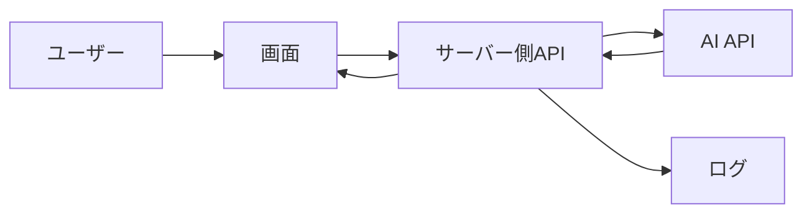

---
title: "AIアプリ開発を始めるための最小構成"
description: "AIアプリを初めて作る人向けに、画面、サーバー処理、AI API、ログ、保存の最小構成を整理します。"
publishedAt: "2026-05-28"
updatedAt: "2026-05-28"
pillar: "開発初心者向けツール紹介/用語解説"
status: "published"
review_status: "approved"
review_result: "ok"
reviewed_at: "2026-05-28T14:02:04.162Z"
review_notes: ""
priority: "high"
estimated_publish_ready: true
needs_fact_check: false
fact_check_status: "completed"
category: "AI開発初心者"
tags:
  - "AIアプリ"
  - "Next.js"
  - "OpenAI API"
  - "初心者"
---

## 結論

AIアプリを最初に作るなら、いきなり大きな機能を入れる必要はありません。

まずは次の5つがあれば十分です。

- 入力する画面
- サーバー側のAPI処理
- AI APIを呼び出す処理
- 結果を表示する画面
- エラーと実行時間を確認するログ

ログイン、決済、管理画面、複雑な保存機能は、最初の検証では必須ではありません。

## 対象読者

- AIアプリを作り始めたい開発初心者
- 何から実装すればよいか迷っている人
- Next.jsとAI APIの役割分担を知りたい人
- 小さく作って検証したい人

## 最小構成の全体像



重要なのは、ブラウザからAI APIを直接呼ばないことです。APIキーを守るため、AI APIの呼び出しはサーバー側で行います。

## 各要素の役割

| 要素 | 役割 | 最初に必要か |
| --- | --- | --- |
| 画面 | 入力フォームと結果表示 | 必要 |
| サーバー側API | 入力チェックとAI API呼び出し | 必要 |
| AI API | 文章生成、要約、分類など | 必要 |
| ログ | エラー、実行時間、入力量の確認 | 必要 |
| 保存 | 履歴や結果の保存 | 後からでよい |
| ログイン | ユーザー管理 | 最初は不要 |
| 決済 | 有料化 | 最初は不要 |

## 画面で決めること

最初の画面では、できることを絞ります。

- ユーザーが何を入力するか
- 実行ボタンは何をするか
- 生成中に何を表示するか
- 成功時に何を表示するか
- 失敗時にどう案内するか

最初から多機能にすると、AIの問題なのかUIの問題なのか切り分けにくくなります。

## サーバー側APIで決めること

サーバー側では、AI APIを呼ぶ前に入力をチェックします。

```ts
export async function POST(request: Request) {
  const { prompt } = await request.json();

  if (!prompt || prompt.length > 2000) {
    return Response.json(
      { error: "入力内容を確認してください。" },
      { status: 400 },
    );
  }

  // ここでAI APIを呼び出す
  return Response.json({ result: "生成結果" });
}
```

最小構成でも、入力チェックは入れておくべきです。長すぎる入力や空の入力をそのままAI APIへ送ると、コストやエラーの原因になります。

## ログで見ること

最初の検証では、ログがとても重要です。

| ログ項目 | 見る理由 |
| --- | --- |
| 入力文字数 | コストや失敗原因を調べるため |
| 実行時間 | 遅い箇所を切り分けるため |
| 成功/失敗 | 安定して動くか確認するため |
| エラー理由 | 修正箇所を見つけるため |

```ts
console.log("ai.generate", {
  inputLength: prompt.length,
  elapsedMs,
  success: true,
});
```

個人情報やAPIキーをログに出さないように注意してください。

## 最初に作らなくてよいもの

| 機能 | 最初に不要な理由 |
| --- | --- |
| ログイン | 検証前に作ると実装範囲が広がる |
| 決済 | 価値検証の後でよい |
| 複雑な管理画面 | 記事やログで代替できることが多い |
| 高度な権限管理 | ユーザーが増えてからでよい |
| 大きなDB設計 | 保存したい情報が固まってからでよい |

最初は「AIの返答が役に立つか」を確認することに集中します。

## 公開前チェックリスト

- APIキーがブラウザに出ていない
- 入力チェックがある
- エラー時の表示がある
- 実行中の表示がある
- ログで失敗理由を確認できる
- 1回あたりのコストをざっくり見積もっている
- 不要なログインや決済を入れていない

## 関連記事

- [Next.jsでAIアプリを作る基本構成](/articles/nextjs-ai-app-basic-architecture)
- [AI APIコスト見積もりガイド](/articles/ai-api-cost-estimation-guide)
- [Next.jsでAIアプリを作る基本構成：画面・API・AI API・ログの役割](/articles/nextjs-ai-app-basic-architecture)

## まとめ

AIアプリ開発の最小構成は、画面、サーバー側API、AI API、結果表示、ログです。

最初から大きく作るより、小さく作って「入力に対してAIの出力が役に立つか」を確認するほうが安全です。価値が見えてから、保存、ログイン、決済、管理画面を順番に追加していくと、開発の迷いが少なくなります。
