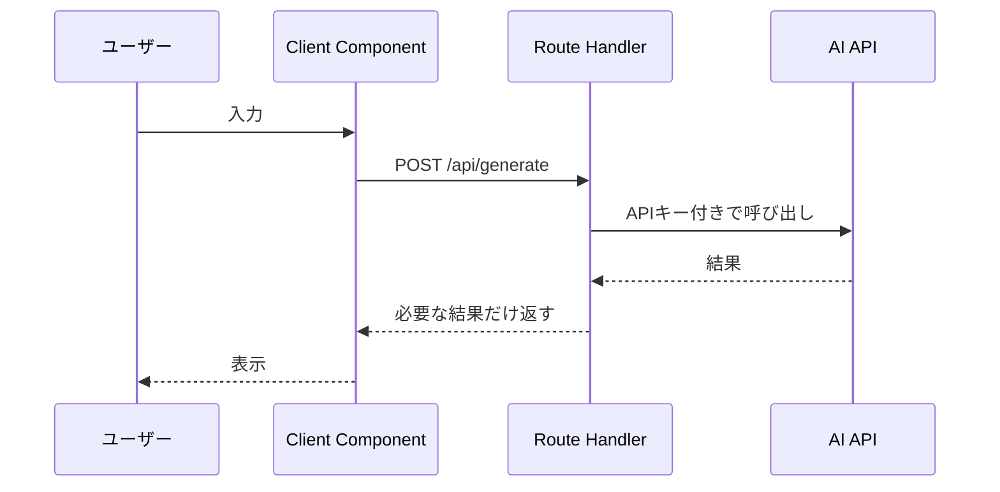

## この記事で分かること

- Next.jsでAI APIを呼ぶときの安全な構成
- APIキー漏洩を防ぐ考え方
- Server ComponentとClient Componentの役割
- よくあるエラーと解決方法

## 想定読者

- Next.jsでAIアプリを作っている人
- AI APIキーをどこで扱うべきか迷っている人
- ローカルでは動くが本番でエラーになる人

## 結論

Next.jsでAI APIを使う場合、APIキーは必ずサーバー側で扱います。ブラウザから直接AI APIを呼ぶと、APIキーが漏洩する危険があります。

基本構成は、Client Componentで入力を受け取り、Route Handlerに送信し、Route HandlerからAI APIを呼ぶ形です。

## 安全な呼び出し構成



## よくあるミスと対策

| ミス | 症状 | 原因 | 対策 |
| --- | --- | --- | --- |
| クライアントから直接AI APIを呼ぶ | APIキーが見える | ブラウザ側に秘密情報を置いている | Route Handlerで呼ぶ |
| 環境変数が本番で読めない | 本番だけ失敗する | デプロイ先に未設定 | 本番環境にも設定する |
| Server/Clientを混同する | ビルドエラーになる | hooksやイベントをServer Componentで使う | UI操作部分をClientに分ける |
| タイムアウト処理がない | 画面が固まる | API失敗時の分岐がない | try/catchとエラー表示を入れる |
| 入力検証がない | 想定外のリクエストが来る | 空文字や長文を許可している | バリデーションする |

## 最小実装の考え方

フロントエンドは、入力と表示だけを担当します。AI APIの呼び出し、APIキーの読み込み、モデル選択、エラー処理はサーバー側APIに置きます。

```text
app/
  page.tsx
  api/
    generate/
      route.ts
```

このように分けると、UIとAI API呼び出しの責務が明確になります。

## Route Handlerで確認すること

- `process.env` からAPIキーを読む
- 入力値が空でないか確認する
- 長すぎる入力を制限する
- AI API失敗時に適切なステータスを返す
- クライアントに不要なエラー詳細を返しすぎない

## 本番で起きやすいエラー

| エラー | 見る場所 | 解決の方向 |
| --- | --- | --- |
| API key missing | サーバーログ | 環境変数を設定 |
| fetch failed | サーバーログ | ネットワーク、URL、権限確認 |
| timeout | サーバーログ、ブラウザ | タイムアウト設定、モデル変更 |
| 500 error | Route Handler | catch内のログ確認 |
| hydration error | ブラウザコンソール | Client/Server分離を見直す |

## 実装前チェックリスト

- [ ] APIキーをClient Componentで使っていない
- [ ] AI API呼び出しはRoute Handlerにある
- [ ] 本番環境に環境変数を設定した
- [ ] 空入力や長すぎる入力を弾いている
- [ ] API失敗時のUI表示がある
- [ ] サーバーログで原因を追える

## まとめ

Next.jsでAI APIを呼ぶときは、セキュリティ境界を意識することが重要です。APIキーはサーバー側に置き、Client Componentは入力と表示に集中させます。最初に構成を分けておくことで、本番公開後のトラブルを減らせます。
