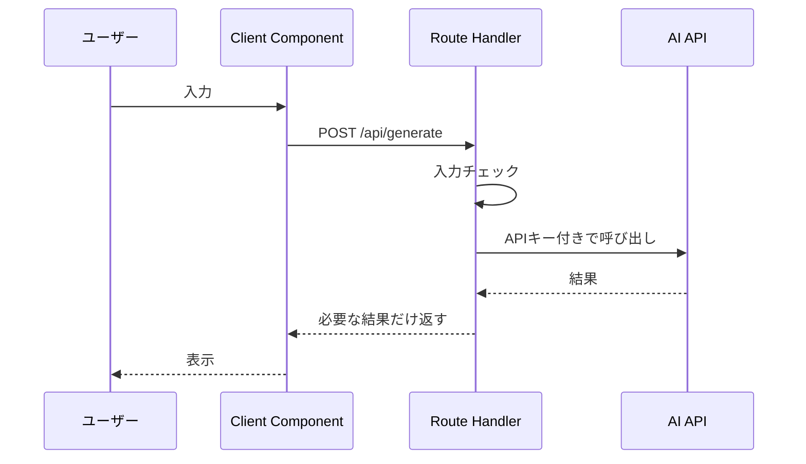

## 結論

Next.jsでAI APIを呼ぶときの最大のミスは、ブラウザ側から直接AI APIを呼ぶことです。

APIキーは必ずサーバー側で扱い、Client Componentは入力と表示に集中させます。基本形は、画面から自分のRoute Handlerへリクエストを送り、Route HandlerがAI APIを呼ぶ構成です。


## 対象読者

- Next.jsでAIアプリを作り始めた人
- APIキーをどこで扱うべきか迷っている人
- ローカルでは動くのに本番でAI API呼び出しが失敗する人
- Client ComponentとServer Componentの役割分担を整理したい人

## 安全な基本構成

AI APIを呼ぶ基本構成は、次のように分けます。



この構成なら、APIキーをブラウザに渡さずに済みます。

## よくあるミスと対策

| ミス | 起きる問題 | 対策 |
| --- | --- | --- |
| Client Componentから直接AI APIを呼ぶ | APIキーが漏れる | Route Handler経由にする |
| `.env` をブラウザ用変数にする | 秘密情報が公開される | `NEXT_PUBLIC_` を付けない |
| 入力チェックをしない | 長文や空文字で無駄なAPI呼び出しが増える | サーバー側で長さと必須項目を確認する |
| エラーを全部500で返す | 原因調査が難しくなる | 入力エラー、API失敗、タイムアウトを分ける |
| ログを残さない | 本番で原因を追えない | requestId、処理時間、エラー種別を残す |
| AIの生レスポンスをそのまま返す | 不要な情報をUIへ渡す | UIに必要な形に整形して返す |

## 最小実装の考え方

ファイル構成は、最初は小さく分ければ十分です。

```text
app/
  page.tsx
  api/
    generate/
      route.ts
```

`page.tsx` は入力フォームと結果表示を担当します。`route.ts` は入力チェック、AI API呼び出し、エラー処理を担当します。

## Route Handlerで確認すること

Route Handlerでは、最低限次を確認します。

- `process.env` からAPIキーを読む
- APIキーがない場合は明確なエラーを返す
- 入力が空ではないか確認する
- 長すぎる入力を弾く
- AI API失敗時にログを残す
- クライアントへ秘密情報を返さない

例として、考え方は次のようになります。

```ts
export async function POST(request: Request) {
  const apiKey = process.env.OPENAI_API_KEY;
  if (!apiKey) {
    return Response.json({ error: "server_not_configured" }, { status: 500 });
  }

  const { prompt } = await request.json();
  if (typeof prompt !== "string" || prompt.trim().length === 0) {
    return Response.json({ error: "invalid_prompt" }, { status: 400 });
  }

  if (prompt.length > 4000) {
    return Response.json({ error: "prompt_too_long" }, { status: 400 });
  }

  // AI API呼び出しはここで行う
}
```

## 本番で起きやすいエラー

| エラー | 見る場所 | 確認すること |
| --- | --- | --- |
| API key missing | サーバーログ | 本番環境に環境変数が設定されているか |
| 401 / 403 | AI APIレスポンス | APIキー、権限、利用可能なモデル |
| timeout | サーバーログ、ブラウザ | 入力長、出力長、タイムアウト設定 |
| fetch failed | サーバーログ | ネットワーク、URL、外部API障害 |
| hydration error | ブラウザコンソール | Client/Server Componentの分離 |

## 実装前チェックリスト

- [ ] APIキーをClient Componentで使っていない
- [ ] AI API呼び出しはRoute Handlerにある
- [ ] 本番環境に必要な環境変数を設定している
- [ ] 入力チェックをサーバー側で行っている
- [ ] API失敗時のログを残している
- [ ] UIに秘密情報や不要なエラー詳細を返していない
- [ ] `npm run build` で確認している

## 関連記事

- [Next.jsでAIアプリを作る基本構成：画面・API・AI API・ログの役割](/articles/nextjs-ai-app-basic-architecture)
- [AI APIの料金を見積もる方法：トークン・実行回数・月間コストの考え方](/articles/ai-api-cost-estimation-guide)
- [AI開発初心者が最初に覚えたい基本用語](/articles/beginner-ai-development-terms)

## まとめ

Next.jsでAI APIを使うときは、まず責務を分けます。

Client Componentは入力と表示、Route HandlerはAPIキー管理とAI API呼び出しを担当します。さらに、入力チェック、エラー分類、ログを入れておくと、本番公開後のトラブルを減らせます。
