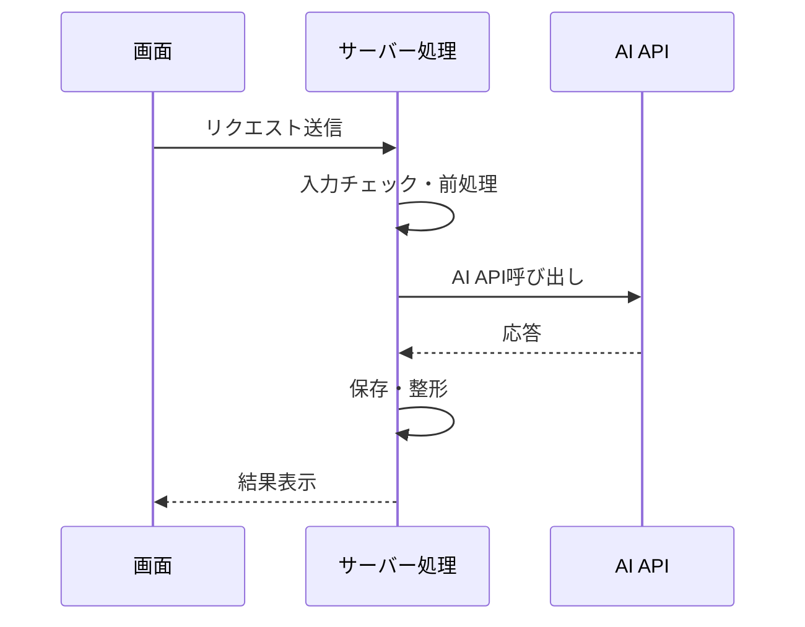

## 結論

AI APIのレスポンスが遅いときは、まず「AI APIそのものが遅い」と決めつけず、処理時間を分解して確認します。

見るべきポイントは次の4つです。

| 確認箇所 | 何が起きているか |
| --- | --- |
| リクエスト前処理 | 入力チェックや履歴整形が重い |
| AI API待ち | モデル処理、出力長、混雑で時間がかかる |
| 後処理 | 保存、整形、DB更新が詰まる |
| UI表示 | 画面が待ちっぱなしで遅く見える |


## 対象読者

- AI APIを組み込んだアプリの応答が遅くて困っている人
- Next.jsなどでAIアプリを作っている人
- タイムアウト、待ち時間、体感速度を改善したい人
- どこから調べればよいか分からない人

## 切り分けの基本

最初に、処理時間を3つに分けて記録します。



この中で、どこに時間がかかっているかをログで分けます。

## ログで確認する項目

サーバー側では、少なくとも次の値を残します。

```ts
const startedAt = Date.now();

console.log("ai.request.start", {
  inputLength: userInput.length,
});

const apiStartedAt = Date.now();
const result = await callAiApi(userInput);
const apiFinishedAt = Date.now();

console.log("ai.request.finish", {
  apiMs: apiFinishedAt - apiStartedAt,
  totalMs: Date.now() - startedAt,
  outputLength: result.length,
});
```

判断の目安は次の通りです。

- `apiMs` が長い: AI API待ちが主因
- `totalMs` だけ長い: 前処理、後処理、保存、画面表示が主因
- `outputLength` が大きい: 出力を短くする余地がある

## 原因別の対策

| 原因 | 対策 |
| --- | --- |
| 入力が長すぎる | 必要な情報だけ送る、履歴を要約する |
| 出力が長すぎる | 文字数、形式、見出し数を指定する |
| リトライが多い | 最大回数と待機時間を決める |
| 保存処理が重い | AI応答表示と保存処理を分ける |
| 画面が待ちっぱなし | ローディング、進行中表示、キャンセル導線を用意する |

## すぐ使えるプロンプト調整例

出力が長すぎる場合は、プロンプトで制限します。

```txt
以下の条件で回答してください。
- 800文字以内
- 見出しは最大3つ
- 箇条書き中心
- 不明な点は推測せず「追加確認が必要」と書く
```

JSONで受けたい場合は、形式も指定します。

```txt
次のJSON形式だけで返してください。
{
  "summary": "100文字以内の要約",
  "actions": ["次に行うこと1", "次に行うこと2"]
}
```

## UXでできる改善

AI APIの応答時間をゼロにはできません。体感速度を改善する設計も必要です。

- 実行中ボタンを無効化する
- 「生成中」と表示する
- キャンセルできるようにする
- 長文はストリーミング表示にする
- 失敗時に再実行ボタンを出す

## 確認チェックリスト

- [ ] API呼び出し前後の時刻をログに残している
- [ ] 入力文字数と出力文字数を確認している
- [ ] タイムアウトとリトライ回数を決めている
- [ ] 長文出力に上限を設けている
- [ ] ユーザーに待ち時間が分かるUIを出している
- [ ] 失敗時に原因が分かるログを残している

## 関連記事

- [Next.jsでAIアプリを作る基本構成：画面・API・AI API・ログの役割](/articles/nextjs-ai-app-basic-architecture)
- [AI APIの料金を見積もる方法：トークン・実行回数・月間コストの考え方](/articles/ai-api-cost-estimation-guide)

## まとめ

AI APIのレスポンスが遅いときは、まず処理時間を分けて測ります。

AI API待ちなのか、前処理なのか、保存や画面表示なのかを分けるだけで、対策は具体的になります。速度改善は、入力削減、出力制御、ログ設計、UI設計を組み合わせて進めるのが現実的です。
