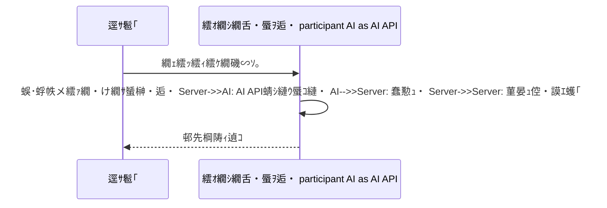

---
title: AI API縺ｮ繝ｬ繧ｹ繝昴Φ繧ｹ縺碁≦縺・凾縺ｮ蜴溷屏縺ｨ蟇ｾ遲・description: AI API縺ｮ蠢懃ｭ斐′驕・＞縺ｨ縺阪↓遒ｺ隱阪☆繧九∋縺榊次蝗縲√Ο繧ｰ縺ｮ隕区婿縲∝・繧雁・縺第焔鬆・€∝ｮ溯｣・ｸ翫・蟇ｾ遲悶ｒ螳溽畑蜷代￠縺ｫ謨ｴ逅・＠縺ｾ縺吶€・publishedAt: '2026-05-28'
updatedAt: '2026-05-28'
pillar: AI繧｢繝励Μ髢狗匱 髢狗匱謇区ｳ・繧ｨ繝ｩ繝ｼ莠倶ｾ九・隗｣豎ｺ豕慕ｴｹ莉・status: draft
review_status: approved
review_result: ok
reviewed_at: '2026-05-28T14:00:13.710Z'
review_notes: ''
priority: high
estimated_publish_ready: false
needs_fact_check: false
fact_check_status: completed
category: 繧ｨ繝ｩ繝ｼ隗｣豎ｺ
tags:
  - AI API
  - 繝代ヵ繧ｩ繝ｼ繝槭Φ繧ｹ
  - 繝ｭ繧ｰ
  - 繧ｨ繝ｩ繝ｼ隗｣豎ｺ
---

## 邨占ｫ・
AI API縺ｮ繝ｬ繧ｹ繝昴Φ繧ｹ縺碁≦縺・→縺阪・縲√∪縺壹€窟I API縺昴・繧ゅ・縺碁≦縺・€阪→豎ｺ繧√▽縺代★縲∝・逅・ｒ蛻・ｧ｣縺励※遒ｺ隱阪＠縺ｾ縺吶€・
隕九ｋ縺ｹ縺阪・繧､繝ｳ繝医・谺｡縺ｮ4縺､縺ｧ縺吶€・
- 繝ｪ繧ｯ繧ｨ繧ｹ繝医ｒ騾√ｋ蜑阪・蜃ｦ逅・′驕・＞
- AI API縺ｮ蠢懃ｭ泌ｾ・■縺碁聞縺・- 蜃ｺ蜉帙′髟ｷ縺吶℃繧・- 逕ｻ髱｢陦ｨ遉ｺ繧・ｿ晏ｭ伜・逅・′隧ｰ縺ｾ縺｣縺ｦ縺・ｋ

繝ｭ繧ｰ縺ｧ譎る俣繧貞・縺代※貂ｬ繧九→縲∵隼蝟・☆縺ｹ縺榊ｴ謇€縺瑚ｦ九∴縺ｾ縺吶€・
## 蟇ｾ雎｡隱ｭ閠・
- AI API繧堤ｵ・∩霎ｼ繧薙□繧｢繝励Μ縺ｮ蠢懃ｭ斐′驕・￥縺ｦ蝗ｰ縺｣縺ｦ縺・ｋ莠ｺ
- Next.js縺ｪ縺ｩ縺ｧAI繧｢繝励Μ繧剃ｽ懊▲縺ｦ縺・ｋ莠ｺ
- 繧ｿ繧､繝繧｢繧ｦ繝医€∝ｾ・■譎る俣縲∽ｽ捺─騾溷ｺｦ繧呈隼蝟・＠縺溘＞莠ｺ
- 縺ｩ縺薙°繧芽ｪｿ縺ｹ繧後・繧医＞縺句・縺九ｉ縺ｪ縺・ｺｺ

## 繧医￥縺ゅｋ逞・憾

| 逞・憾 | 縺ｾ縺夂桝縺・％縺ｨ |
| --- | --- |
| 繝懊ち繝ｳ繧呈款縺励※縺九ｉ縺壹▲縺ｨ蠕・▽ | 蜈･蜉帛・逅・€、PI蠕・■縲∫判髱｢陦ｨ遉ｺ縺ｮ縺ｩ縺薙°縺瑚ｩｰ縺ｾ縺｣縺ｦ縺・ｋ |
| 縺ｨ縺阪←縺阪□縺鷹≦縺・| 蜈･蜉幃㍼縲∝､夜ΚAPI縲√ロ繝・ヨ繝ｯ繝ｼ繧ｯ縲√Μ繝医Λ繧､繧堤｢ｺ隱阪☆繧・|
| 髟ｷ譁・函謌舌□縺鷹≦縺・| 蜃ｺ蜉帙ヨ繝ｼ繧ｯ繝ｳ縺悟､壹☆縺弱ｋ蜿ｯ閭ｽ諤ｧ縺後≠繧・|
| 繝ｭ繝ｼ繧ｫ繝ｫ縺ｧ縺ｯ騾溘＞縺梧悽逡ｪ縺ｧ驕・＞ | 繧ｵ繝ｼ繝舌・迺ｰ蠅・€√Μ繝ｼ繧ｸ繝ｧ繝ｳ縲√Ο繧ｰ縲√ち繧､繝繧｢繧ｦ繝医ｒ遒ｺ隱阪☆繧・|

## 蛻・ｊ蛻・￠縺ｮ蝓ｺ譛ｬ

譛€蛻昴↓縲∝・逅・凾髢薙ｒ3縺､縺ｫ蛻・￠縺ｦ險倬鹸縺励∪縺吶€・


縺薙・荳ｭ縺ｧ縲√←縺薙↓譎る俣縺後°縺九▲縺ｦ縺・ｋ縺九ｒ繝ｭ繧ｰ縺ｧ蛻・￠縺ｾ縺吶€・
## 繝ｭ繧ｰ縺ｧ遒ｺ隱阪☆繧矩・岼

繧ｵ繝ｼ繝舌・蛛ｴ縺ｧ縺ｯ縲∝ｰ代↑縺上→繧よｬ｡縺ｮ譎ょ綾繧定ｨ倬鹸縺励∪縺吶€・
```ts
const startedAt = Date.now();

console.log("ai.request.start", {
  inputLength: userInput.length,
});

const apiStartedAt = Date.now();
const result = await callAiApi(userInput);
const apiFinishedAt = Date.now();

console.log("ai.request.finish", {
  apiMs: apiFinishedAt - apiStartedAt,
  totalMs: Date.now() - startedAt,
  outputLength: result.length,
});
```

隕九ｋ縺ｹ縺榊€､縺ｯ `apiMs` 縺ｨ `totalMs` 縺ｮ蟾ｮ縺ｧ縺吶€・
- `apiMs` 縺碁聞縺・ AI API蠕・■縺御ｸｻ蝗
- `totalMs` 縺縺鷹聞縺・ 蜑榊・逅・€∝ｾ悟・逅・€∽ｿ晏ｭ倥€∫判髱｢陦ｨ遉ｺ縺御ｸｻ蝗
- `outputLength` 縺悟､ｧ縺阪＞: 蜃ｺ蜉帙ｒ遏ｭ縺上☆繧倶ｽ吝慍縺後≠繧・
## 蜴溷屏蛻･縺ｮ蟇ｾ遲・
| 蜴溷屏 | 蟇ｾ遲・|
| --- | --- |
| 蜈･蜉帙′髟ｷ縺吶℃繧・| 蠢・ｦ√↑諠・ｱ縺縺鷹€√ｋ縲∝ｱ･豁ｴ繧定ｦ∫ｴ・☆繧・|
| 蜃ｺ蜉帙′髟ｷ縺吶℃繧・| 譁・ｭ玲焚縲∝ｽ｢蠑上€∬ｦ句・縺玲焚繧呈欠螳壹☆繧・|
| 繝ｪ繝医Λ繧､縺悟､壹＞ | 譛€螟ｧ蝗樊焚縺ｨ蠕・ｩ滓凾髢薙ｒ豎ｺ繧√ｋ |
| 菫晏ｭ伜・逅・′驥阪＞ | AI蠢懃ｭ碑｡ｨ遉ｺ縺ｨ菫晏ｭ伜・逅・ｒ蛻・￠繧・|
| 逕ｻ髱｢縺悟ｾ・■縺｣縺ｱ縺ｪ縺・| 繝ｭ繝ｼ繝・ぅ繝ｳ繧ｰ縲・€ｲ陦御ｸｭ陦ｨ遉ｺ縲√く繝｣繝ｳ繧ｻ繝ｫ蟆守ｷ壹ｒ逕ｨ諢上☆繧・|

## 縺吶＄菴ｿ縺医ｋ繝励Ο繝ｳ繝励ヨ隱ｿ謨ｴ萓・
蜃ｺ蜉帙′髟ｷ縺吶℃繧句ｴ蜷医・縲√・繝ｭ繝ｳ繝励ヨ縺ｧ蛻ｶ髯舌＠縺ｾ縺吶€・
```txt
莉･荳九・譚｡莉ｶ縺ｧ蝗樒ｭ斐＠縺ｦ縺上□縺輔＞縲・- 800譁・ｭ嶺ｻ･蜀・- 隕句・縺励・譛€螟ｧ3縺､
- 邂・擅譖ｸ縺堺ｸｭ蠢・- 荳肴・縺ｪ轤ｹ縺ｯ謗ｨ貂ｬ縺帙★縲瑚ｿｽ蜉遒ｺ隱阪′蠢・ｦ√€阪→譖ｸ縺・```

JSON縺ｧ蜿励￠縺溘＞蝣ｴ蜷医・縲∝ｽ｢蠑上ｂ謖・ｮ壹＠縺ｾ縺吶€・
```txt
谺｡縺ｮJSON蠖｢蠑上□縺代〒霑斐＠縺ｦ縺上□縺輔＞縲・{
  "summary": "100譁・ｭ嶺ｻ･蜀・・隕∫ｴ・,
  "actions": ["谺｡縺ｫ陦後≧縺薙→1", "谺｡縺ｫ陦後≧縺薙→2"]
}
```

## UX縺ｧ縺ｧ縺阪ｋ謾ｹ蝟・
AI API縺ｮ蠢懃ｭ疲凾髢薙ｒ繧ｼ繝ｭ縺ｫ縺ｯ縺ｧ縺阪∪縺帙ｓ縲ゆｽ捺─騾溷ｺｦ繧呈隼蝟・☆繧玖ｨｭ險医ｂ蠢・ｦ√〒縺吶€・
- 螳溯｡御ｸｭ繝懊ち繝ｳ繧堤┌蜉ｹ蛹悶☆繧・- 縲檎函謌蝉ｸｭ縲阪→陦ｨ遉ｺ縺吶ｋ
- 繧ｭ繝｣繝ｳ繧ｻ繝ｫ縺ｧ縺阪ｋ繧医≧縺ｫ縺吶ｋ
- 髟ｷ譁・・繧ｹ繝医Μ繝ｼ繝溘Φ繧ｰ陦ｨ遉ｺ縺ｫ縺吶ｋ
- 螟ｱ謨玲凾縺ｫ蜀榊ｮ溯｡後・繧ｿ繝ｳ繧貞・縺・
## 遒ｺ隱阪メ繧ｧ繝・け繝ｪ繧ｹ繝・
- API蜻ｼ縺ｳ蜃ｺ縺怜燕蠕後・譎ょ綾繧偵Ο繧ｰ縺ｫ谿九＠縺ｦ縺・ｋ
- 蜈･蜉帶枚蟄玲焚縺ｨ蜃ｺ蜉帶枚蟄玲焚繧堤｢ｺ隱阪＠縺ｦ縺・ｋ
- 繧ｿ繧､繝繧｢繧ｦ繝医→繝ｪ繝医Λ繧､蝗樊焚繧呈ｱｺ繧√※縺・ｋ
- 髟ｷ譁・・蜉帙↓荳企剞繧定ｨｭ縺代※縺・ｋ
- 繝ｦ繝ｼ繧ｶ繝ｼ縺ｫ蠕・■譎る俣縺悟・縺九ｋUI繧貞・縺励※縺・ｋ
- 螟ｱ謨玲凾縺ｫ蜴溷屏縺悟・縺九ｋ繝ｭ繧ｰ繧呈ｮ九＠縺ｦ縺・ｋ

## 髢｢騾｣險倅ｺ・
- [Next.js縺ｧAI繧｢繝励Μ繧剃ｽ懊ｋ蝓ｺ譛ｬ讒区・](/articles/nextjs-ai-app-basic-architecture)
- [AI API繧ｳ繧ｹ繝郁ｦ狗ｩ阪ｂ繧翫ぎ繧､繝云(/articles/ai-api-cost-estimation-guide)

## 縺ｾ縺ｨ繧・
AI API縺ｮ繝ｬ繧ｹ繝昴Φ繧ｹ縺碁≦縺・→縺阪・縲√∪縺壼・逅・凾髢薙ｒ蛻・￠縺ｦ貂ｬ繧翫∪縺吶€・I API蠕・■縺ｪ縺ｮ縺九€∝燕蜃ｦ逅・↑縺ｮ縺九€∽ｿ晏ｭ倥ｄ逕ｻ髱｢陦ｨ遉ｺ縺ｪ縺ｮ縺九ｒ蛻・￠繧九□縺代〒縲∝ｯｾ遲悶・縺九↑繧雁・菴鍋噪縺ｫ縺ｪ繧翫∪縺吶€・
騾溷ｺｦ謾ｹ蝟・・縲、PI險ｭ螳壹□縺代〒縺ｯ縺ｪ縺上€∝・蜉帛炎貂帙€∝・蜉帛宛蠕｡縲√Ο繧ｰ險ｭ險医€ゞI險ｭ險医ｒ邨・∩蜷医ｏ縺帙※騾ｲ繧√ｋ縺ｮ縺檎樟螳溽噪縺ｧ縺吶€・