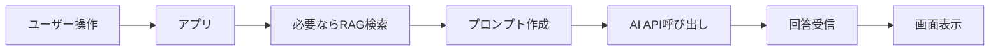

## この記事で分かること

- AI APIのレスポンスが遅くなる主な原因
- 体感速度と実処理時間の違い
- ログで切り分ける方法
- 実装で使える改善策

## よくある症状

- ボタンを押してから回答が表示されるまで長い
- ローカルでは速いのに本番だけ遅い
- RAGを入れたら急に遅くなった
- たまにタイムアウトする
- ユーザーから「固まっている」と見える

## 結論

AI APIの遅さは、モデルの処理時間だけが原因ではありません。プロンプトの長さ、RAG検索、外部API、サーバー設定、ストリーミング未対応などが重なって遅くなります。

まずは、どの処理に時間がかかっているかを分けて測定します。そのうえで、実処理時間を短くする対策と、ユーザーの体感速度を改善する対策を分けて考えます。

## レスポンス生成の流れ



## 原因と対策の対応表

| 原因 | 症状 | 対策 |
| --- | --- | --- |
| プロンプトが長い | 毎回遅い、コストも高い | 指示文を短くする |
| RAG検索が重い | RAG導入後に遅い | 検索対象、件数、chunkを見直す |
| 出力が長い | 回答完了まで遅い | 出力形式や文字数を指定する |
| 高性能モデルだけ使う | 全体的に遅い | 軽量モデルと使い分ける |
| 外部API待ち | 特定条件で遅い | 並列化、キャッシュ、タイムアウト |
| ストリーミングなし | 固まって見える | 逐次表示を導入する |

## まず入れるべきログ

```text
request_start
rag_search_start
rag_search_end
ai_api_start
ai_api_end
response_sent
```

このように段階ごとに時刻を残すと、遅い原因が検索なのか、AI APIなのか、表示なのかを分けられます。

## 体感速度を改善する方法

実際の処理時間をゼロにはできません。そこで、ユーザーが待っていることを理解できるUIが重要です。

- ローディング表示を出す
- ストリーミングで少しずつ表示する
- 進行中のステータスを出す
- 長い処理はキャンセルできるようにする
- 失敗時は再試行ボタンを出す

## 実処理時間を短くする方法

- システムプロンプトを短くする
- RAGの検索件数を減らす
- 検索結果の本文を短く整形する
- 回答文字数を制限する
- 軽量モデルを使う
- 同じ入力への回答をキャッシュする
- 独立した外部API呼び出しは並列化する

## チェックリスト

- [ ] AI API呼び出し時間をログで測っている
- [ ] RAG検索時間をログで測っている
- [ ] 入力トークン数を把握している
- [ ] 出力文字数を制御している
- [ ] ストリーミング表示を検討した
- [ ] タイムアウト時の表示がある
- [ ] 同じ結果をキャッシュできないか確認した

## まとめ

AI APIのレスポンスが遅いときは、いきなりモデルを変えるのではなく、処理のどこが遅いかを分解します。ログで原因を見つけ、プロンプト、RAG、モデル、UIの順に改善すると、実処理時間と体感速度の両方を改善できます。
