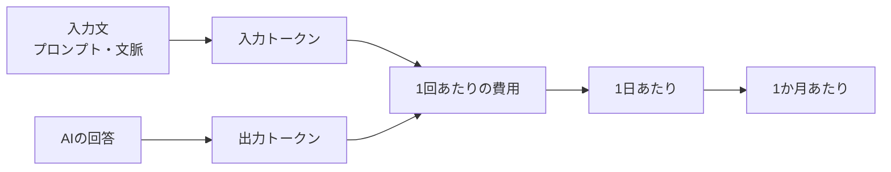

## この記事で分かること

- AI APIの料金が増える仕組み
- 入力トークン、出力トークン、実行回数の考え方
- 月額コストをざっくり見積もる方法
- 公開前に確認すべきコスト増加ポイント

## 想定読者

- AI APIの料金体系が分からない人
- AIアプリ公開前に月額費用を見積もりたい人
- APIコストが増える原因を知りたい人

## 結論

AI APIのコストは、基本的に「1回あたりに使うトークン数」と「実行回数」で決まります。つまり、ユーザー数が少なくても、1回のリクエストが重ければ費用は増えます。逆に、ユーザー数が増えても、プロンプトや出力を短く保てればコストを抑えやすくなります。

公開前には、最低でも1回あたり、1日あたり、1か月あたりの概算を出しておくべきです。

## AI APIコストの全体像



## 用語整理

| 用語 | 意味 | コストへの影響 |
| --- | --- | --- |
| 入力トークン | AI APIに送る文章量 | 長いほど増える |
| 出力トークン | AIが返す文章量 | 長いほど増える |
| 実行回数 | 何回APIを呼ぶか | 多いほど増える |
| モデル単価 | モデルごとの料金 | 高性能モデルほど高い傾向 |
| RAG文脈 | 検索して追加する文章 | 入力トークンを増やす |

## 基本の計算式

```text
入力コスト = 入力トークン数 / 1,000,000 * 入力単価
出力コスト = 出力トークン数 / 1,000,000 * 出力単価
1回あたり = 入力コスト + 出力コスト
1日あたり = 1回あたり * 1日の実行回数
1か月あたり = 1日あたり * 30
```

## 見積もり例

| 項目 | 値 |
| --- | ---: |
| 入力トークン | 2,000 |
| 出力トークン | 800 |
| 1日あたり実行回数 | 100 |
| 入力単価 | $2.50 / 100万トークン |
| 出力単価 | $10.00 / 100万トークン |

この場合、1回あたりは入力分と出力分を足して計算します。実際の単価は使うモデルによって変わるため、公開前には必ず公式料金ページで確認します。

## コストが増えやすいパターン

| パターン | なぜ増えるか | 対策 |
| --- | --- | --- |
| システムプロンプトが長い | 毎回入力トークンとして送られる | 共通指示を短くする |
| RAGで文書を渡しすぎる | 検索結果が入力に加算される | 上位数件に絞る |
| 回答が長い | 出力トークンが増える | 文字数や形式を指定する |
| 高性能モデルだけ使う | 単価が高い | 軽量モデルとの使い分け |
| リトライが多い | 実行回数が増える | エラー原因をログで確認する |

## コストを下げる設計

- 短いプロンプトで同じ品質が出るようにする
- 出力フォーマットを指定して無駄な文章を減らす
- RAGで渡す文脈を必要最小限にする
- 軽量モデルで足りる処理は軽量モデルにする
- 同じ質問への回答をキャッシュする
- 管理者向けに利用回数のログを残す

## 公開前チェックリスト

- [ ] 1回あたりの入力トークンを見積もった
- [ ] 1回あたりの出力トークンを見積もった
- [ ] 1日あたりの想定実行回数を決めた
- [ ] 使うモデルの単価を確認した
- [ ] 月額費用の上限を決めた
- [ ] 異常な連続実行を防ぐ仕組みを検討した

## 関連ツール導線

このサイトの「AI API Cost Estimator」を使うと、入力トークン数、出力トークン数、実行回数から概算コストを計算できます。

## まとめ

AI APIのコストは、公開後に初めて気づくと対策が遅れます。作る前に概算し、プロンプト、モデル、RAG文脈、実行回数を調整することで、継続しやすいAIアプリにできます。
