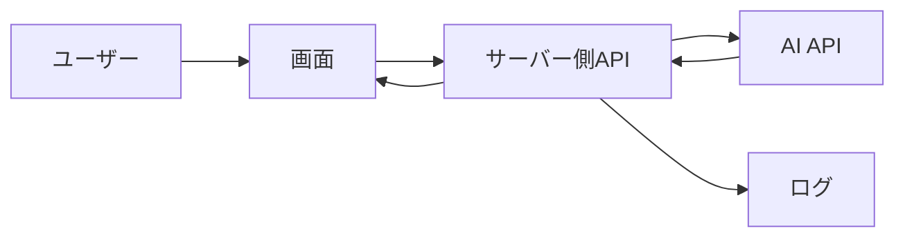

## 結論

AIアプリ開発を始める前に決めるべきことは、機能一覧よりも「何を入力し、何を返し、どう成功と判断するか」です。

最初に決める項目は、次の6つです。

| 項目 | 決めること |
| --- | --- |
| 目的 | 誰のどんな問題を解決するか |
| 入力 | ユーザーが何を渡すか |
| 出力 | AIがどんな形式で返すか |
| 評価 | 良い回答をどう判断するか |
| 制限 | コスト、速度、文字数の上限 |
| 運用 | ログ、エラー、改善方法 |


## 対象読者

- AIアプリを作りたいが、最初に何を決めるべきか迷っている人
- AI APIを使った小さな機能を作り始めたい人
- 作りながら要件が膨らんでしまうのを避けたい人
- Codexなどに記事や実装を依頼する前に内容を整理したい人

## まず目的を1文で書く

最初に、アプリの目的を1文で書きます。

```txt
誰が、何に困っていて、このAIアプリで何を楽にするのか。
```

例:

| 悪い例 | 良い例 |
| --- | --- |
| AIで文章を作るアプリ | 問い合わせ文を3行の返信案に要約するアプリ |
| 社内文書を検索するアプリ | 社内規程から該当箇所と根拠を返すアプリ |
| ニュースをまとめるアプリ | AI開発者向けに重要ニュースだけを候補化するアプリ |

目的が曖昧なまま作ると、プロンプト、UI、ログ、評価基準が全部ぶれます。

## 入力と出力を具体化する

AIアプリでは、入力と出力を先に決めると実装が安定します。

| 観点 | 決めること |
| --- | --- |
| 入力の種類 | テキスト、URL、Markdown、CSV、画像など |
| 入力の長さ | 最大文字数、ファイルサイズ、件数 |
| 出力形式 | 文章、表、JSON、チェックリストなど |
| 出力の長さ | 文字数、項目数、見出し数 |
| 禁止事項 | 推測しない、個人情報を出さない、外部送信しない |

出力形式を決めないと、画面表示や後続処理が作りにくくなります。

## AIの品質をどう評価するか

AI機能は、動けば完成ではありません。

最低限、次のような評価質問を用意します。

| 評価観点 | 例 |
| --- | --- |
| 正確性 | 事実と違う説明をしていないか |
| 実用性 | ユーザーが次の行動を取れるか |
| 一貫性 | 毎回出力形式が大きく崩れないか |
| 安全性 | 秘密情報や危険な操作を促していないか |
| コスト | 長すぎる入力や出力になっていないか |

RAGや記事生成のような機能では、評価用の質問セットを持つと改善しやすくなります。

## コストと制限を先に決める

AI APIを使う場合、コストと制限は後回しにしないほうが安全です。

公開前には、次を決めます。

- 1回あたりの最大入力文字数
- 1回あたりの最大出力文字数
- 1ユーザーあたりの実行回数
- タイムアウト秒数
- リトライ回数
- エラー時に表示する文言

これらを決めておくと、想定外の長文入力や連続実行でコストが増えるリスクを抑えられます。

## 最小構成で始める

最初のAIアプリは、次の構成で十分です。



ログイン、決済、ダッシュボード、複雑な管理画面は、最初の検証では必須ではありません。

## 実装前チェックリスト

- [ ] 誰のどんな問題を解決するか1文で書ける
- [ ] 入力の種類と最大長を決めている
- [ ] 出力形式と長さを決めている
- [ ] 良い回答を判断する基準がある
- [ ] コストや実行回数の上限を決めている
- [ ] エラー時の表示とログを決めている
- [ ] 最初からSaaS、ログイン、決済を作り込まない方針になっている

## 関連記事

- [AIプロダクト開発とは？生成AIアプリを作る前に知るべき基本](/articles/what-is-ai-product-development)
- [AIアプリ開発を始めるための最小構成](/articles/beginner-minimum-ai-app-architecture)
- [AI APIの料金を見積もる方法：トークン・実行回数・月間コストの考え方](/articles/ai-api-cost-estimation-guide)

## まとめ

AIアプリ開発を始める前に、目的、入力、出力、評価、制限、運用を小さく決めておくと、実装中の迷走を減らせます。

最初から大きなサービスを作る必要はありません。まずは検証できる最小構成を作り、ログと評価基準を使って改善していくのが現実的です。
