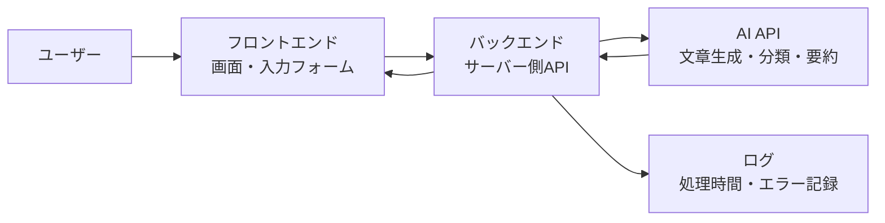

## 結論

AIアプリ開発の用語は、最初からすべて暗記する必要はありません。

まずは「画面で入力する」「サーバーで処理する」「AI APIへ送る」「結果を表示する」という流れの中で、どの言葉がどこに出てくるかを押さえると理解しやすくなります。

この記事では、AI開発初心者が最初につまずきやすい基本用語を、実際の開発の流れに沿って整理します。

## 対象読者

- AIアプリ開発を始めたばかりの人
- API、フロントエンド、バックエンドの違いがまだ曖昧な人
- AI API、プロンプト、トークン、環境変数などの言葉をまとめて理解したい人
- CodexやAI開発ツールに作業を依頼するとき、最低限の用語を知っておきたい人

## まず全体像をつかむ

AIアプリは、細かく見ると多くの部品があります。ただし初心者のうちは、次の5つに分けて考えるだけで十分です。



この図で見ると、AI APIはアプリ全体の一部です。AI APIだけを覚えるのではなく、画面、サーバー、APIキー、ログとセットで理解すると、実装時の判断がしやすくなります。

## 最初に覚えたい用語一覧

| 用語 | 短い意味 | 開発で出てくる場面 |
| --- | --- | --- |
| フロントエンド | ユーザーが見る画面側 | 入力フォーム、ボタン、結果表示 |
| バックエンド | サーバー側で処理する部分 | APIキー管理、AI API呼び出し、保存 |
| API | プログラム同士がやり取りする窓口 | 画面からサーバーへ送る、AI APIを呼ぶ |
| AI API | AIモデルを外部から使うためのAPI | 文章生成、要約、分類、チャット応答 |
| プロンプト | AIへの指示文 | 「この文章を要約して」など |
| トークン | AIが文章を処理する単位 | API料金、入力上限、出力上限 |
| 環境変数 | 秘密情報や設定値を外に出す仕組み | APIキー、URL、トークン管理 |
| ログ | 動作やエラーの記録 | エラー調査、速度改善、利用状況確認 |
| レスポンス | APIから返ってくる結果 | AIの回答、エラー内容、ステータス |
| デプロイ | 作ったアプリを公開環境で動かすこと | VPS、Vercel、Dockerなど |

## フロントエンドとは

フロントエンドは、ユーザーが直接見る部分です。

AIアプリでは、たとえば次のような役割を持ちます。

- 質問文を入力するフォーム
- 送信ボタン
- AIの回答を表示する領域
- エラー時のメッセージ
- 読み込み中の表示

初心者が気をつけたいのは、フロントエンドに秘密情報を置かないことです。AI APIキーをブラウザ側のコードに入れると、ユーザーから見えてしまう可能性があります。

## バックエンドとは

バックエンドは、ユーザーから直接見えにくいサーバー側の処理です。

AIアプリでは、主に次を担当します。

| 役割 | 内容 |
| --- | --- |
| 入力チェック | 空文字、長すぎる文章、不正な形式を止める |
| APIキー管理 | AI APIキーを安全に読み込む |
| AI API呼び出し | プロンプトをAIへ送り、結果を受け取る |
| エラー処理 | API失敗時に適切なメッセージを返す |
| ログ記録 | 処理時間や失敗理由を残す |

AIアプリでは、フロントエンドから直接AI APIを呼ぶのではなく、バックエンドを経由する形が基本です。

## APIとは

APIは、プログラム同士が決まった形でやり取りするための窓口です。

たとえばAIチャット画面では、次のような流れになります。

1. ユーザーが画面に質問を入力する
2. フロントエンドがサーバー側APIへ質問を送る
3. サーバー側APIがAI APIへ質問を送る
4. AI APIが回答を返す
5. サーバー側APIがフロントエンドへ回答を返す
6. 画面に回答が表示される

「APIを呼ぶ」とは、この窓口に必要な情報を送って、結果を受け取ることです。

## AI APIとは

AI APIは、AIモデルを自分のアプリから使うためのAPIです。

AI APIを使うと、アプリの中で次のような機能を作れます。

- 文章を要約する
- 問い合わせ文を分類する
- チャット形式で回答する
- 商品説明やメール文を生成する
- 入力文から必要な情報を抜き出す

ただし、AI APIは呼び出すたびに料金や待ち時間が発生することがあります。そのため、公開前には入力の長さ、実行回数、エラー時のリトライを考えておく必要があります。

料金の考え方は [AI APIコスト見積もりガイド](/articles/ai-api-cost-estimation-guide) や [AI API Cost Estimator](/tools/ai-api-cost-estimator) も参考になります。

## プロンプトとは

プロンプトは、AIに渡す指示文です。

たとえば、次のような文章がプロンプトです。

```txt
次の文章を初心者向けに3行で要約してください。
専門用語が出る場合は、短い補足説明も付けてください。

対象文章:
...
```

プロンプトでは、単に「要約して」と書くよりも、出力形式、対象読者、注意点を一緒に指定すると安定しやすくなります。

| 悪い例 | 改善例 |
| --- | --- |
| 要約して | 初心者向けに3行で要約してください |
| いい感じに直して | 誤字を直し、意味を変えずに自然な日本語にしてください |
| 分類して | 「問い合わせ」「不具合」「要望」のどれかに分類してください |

## トークンとは

トークンは、AIが文章を処理するための単位です。

日本語の文字数と完全に一致するわけではありませんが、初心者のうちは「AIが文章を読むための細かい単位」と考えると十分です。

トークンは主に次に影響します。

- 入力できる文章量
- AIが返せる文章量
- API料金
- 処理速度

長い文章をそのままAIに送ると、トークンが増え、料金や待ち時間も増える可能性があります。AIアプリでは、必要な情報だけを送る設計が大切です。

## 環境変数とは

環境変数は、アプリの外側から設定値を渡す仕組みです。

AI開発では、APIキーのような秘密情報をコードに直接書かないために使います。

```txt
OPENAI_API_KEY=sk-...
DATABASE_URL=...
DRAFT_REVIEW_TOKEN=...
```

コードには、実際のキーではなく「環境変数から読む」という処理だけを書きます。

```ts
const apiKey = process.env.OPENAI_API_KEY;
```

これにより、GitHubに秘密情報を置かずに済みます。`.env`ファイルや実トークンはコミットしない、というルールもここにつながります。

## ログとは

ログは、アプリの動作記録です。

AIアプリでは、ログがないと「AI APIが遅いのか」「サーバー処理が失敗したのか」「入力が長すぎたのか」を判断しにくくなります。

最初は、次のような情報を残すだけでも役立ちます。

| ログ項目 | 目的 |
| --- | --- |
| 処理開始時刻 | どこで時間がかかったか確認する |
| AI API呼び出し時間 | API待ちが長いか確認する |
| エラー種別 | APIキー不足、入力不正、外部API失敗などを分ける |
| 入力文字数 | 長すぎる入力が原因か確認する |
| リクエストID | どの操作で起きた問題か追跡する |

ただし、個人情報やAPIキーをログに出してはいけません。

## 混同しやすい言葉

| 混同しやすい言葉 | 違い |
| --- | --- |
| APIとAI API | APIは広い言葉。AI APIはAIモデルを使うためのAPI |
| プロンプトと入力 | 入力はユーザーが入れた文章。プロンプトはAIに渡す指示全体 |
| フロントエンドとバックエンド | フロントエンドは画面側。バックエンドはサーバー側 |
| APIキーと環境変数 | APIキーは秘密情報。環境変数は秘密情報を外から渡す仕組み |
| ログとエラー | エラーは失敗そのもの。ログは成功や失敗の記録 |

## 初心者が最初に確認するチェックリスト

- [ ] AI APIキーをフロントエンドに置いていない
- [ ] サーバー側APIを経由してAI APIを呼んでいる
- [ ] プロンプトに出力形式や対象読者を書いている
- [ ] 入力が長すぎる場合の制限を決めている
- [ ] API失敗時のエラーメッセージを用意している
- [ ] APIキーや個人情報をログに出していない
- [ ] 公開前にAPIコストの目安を確認している

## 関連記事

- [Next.jsでAIアプリを作る基本構成：画面・API・AI API・ログの役割](/articles/nextjs-ai-app-basic-architecture)
- [OpenAI APIを使ったAIアプリ開発の始め方](/articles/openai-api-first-setup)
- [AI APIコスト見積もりガイド](/articles/ai-api-cost-estimation-guide)
- [AI API Cost Estimator](/tools/ai-api-cost-estimator)

## まとめ

AI開発初心者は、まず用語を開発の流れに結びつけて理解すると迷いにくくなります。

フロントエンドは画面、バックエンドはサーバー側処理、APIはプログラム同士の窓口、AI APIはAIモデルを使うための窓口です。プロンプト、トークン、環境変数、ログは、AIアプリを安全に運用するために早めに覚えておきたい言葉です。

最初から完璧な設計を目指すよりも、言葉の意味と役割を押さえながら、小さく動くAIアプリを作り、少しずつ改善していきましょう。
