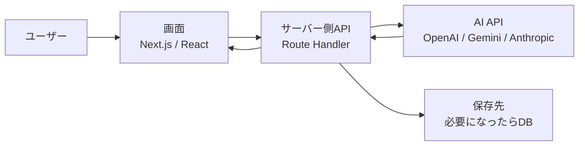

## この記事で分かること

- AIアプリを作るときに必要な最小構成
- フロントエンド、サーバー側API、AI API、DB、公開環境の役割
- 初心者が最初に作るべき小さな構成
- 最初から入れなくてもよい機能

## 想定読者

- AIアプリを作ってみたいが、何から始めればよいか分からない人
- Next.jsでAI APIを呼ぶ小さなアプリを作りたい人
- 個人開発や小規模プロダクトの最初の構成を知りたい人

## 結論

AIアプリ開発の最初の目標は、大きなSaaSを作ることではありません。まずは「入力する」「サーバー側でAI APIを呼ぶ」「結果を表示する」の3ステップが動けば十分です。

そのうえで、必要になったらログ保存、ユーザー管理、課金、管理画面を足していきます。最初から全部を入れると、学習コストも実装コストも高くなり、完成前に止まりやすくなります。

## 最小構成の全体像



## 構成要素の役割

| 要素 | 役割 | 最初から必要か | 例 |
| --- | --- | --- | --- |
| フロントエンド | 入力フォームと結果表示 | 必要 | Next.js App Router |
| サーバー側API | APIキーを隠してAI APIを呼ぶ | 必要 | Route Handler |
| AI API | 文章生成、要約、分類、回答 | 必要 | OpenAI API、Gemini API |
| DB | 入力、回答、履歴の保存 | 任意 | PostgreSQL、Supabase |
| 認証 | ユーザーごとの管理 | 後回しでよい | NextAuth、Clerk |
| 決済 | 有料化 | 後回しでよい | Stripe |
| 公開環境 | Web上に公開する | 必要 | Vercel、VPS、Docker |

## 初心者におすすめの構成

最初の1本目としては、以下の構成が扱いやすいです。

```text
画面: Next.js App Router
API: Route Handler
AI API: OpenAI API または Gemini API
保存先: なし
公開: Vercel または Docker on VPS
```

DBを入れない理由は、まずAI APIとの接続と画面表示に集中するためです。保存機能は便利ですが、最初から入れると設計することが増えます。

## 作る順番

1. 画面に入力フォームを作る
2. `/api/generate` のようなサーバー側APIを作る
3. サーバー側APIからAI APIを呼ぶ
4. 結果を画面に表示する
5. エラー時の表示を追加する
6. 必要になったら履歴保存を追加する

## 最初に作りやすいAIアプリ例

| アプリ例 | 入力 | 出力 | 難易度 |
| --- | --- | --- | --- |
| 文章要約ツール | 長文テキスト | 要約文 | 低 |
| メール文面作成 | 目的、相手、トーン | メール案 | 低 |
| FAQ回答ツール | 質問文 | 回答案 | 中 |
| 記事タイトル案生成 | 記事テーマ | タイトル候補 | 低 |
| コード説明ツール | コード断片 | 解説 | 中 |

## よくある失敗

| 失敗 | 原因 | 対策 |
| --- | --- | --- |
| APIキーをブラウザに出す | クライアント側から直接AI APIを呼ぶ | 必ずサーバー側APIで呼ぶ |
| 最初から機能を増やしすぎる | 認証、決済、DBを同時に入れる | まず1機能だけ動かす |
| エラー時に何も表示されない | catch処理がない | エラーメッセージを画面に出す |
| コストが読めない | トークン数と実行回数を見ていない | 公開前に概算する |
| 本番で環境変数がない | ローカルだけ設定している | デプロイ先にも設定する |

## 実装前チェックリスト

- [ ] 作る機能を1つに絞った
- [ ] APIキーをサーバー側だけで扱う設計にした
- [ ] AI APIが失敗したときの表示を考えた
- [ ] 1回あたりの入力・出力トークンをざっくり見積もった
- [ ] DBが本当に最初から必要か確認した
- [ ] 公開環境の環境変数設定方法を確認した

## 次に読む記事

- AI APIコスト見積もりの基本
- Next.jsでAI APIを呼ぶ時のよくあるミス
- RAG入門: ベクトルDBを使う前に理解すること

## まとめ

AIアプリの最小構成は、画面、サーバー側API、AI APIの3つから始められます。最初からSaaSらしい機能を全部入れる必要はありません。小さく動かして、コスト、保存、認証、運用を順番に足していくのが、初心者にとってもっとも現実的な進め方です。
