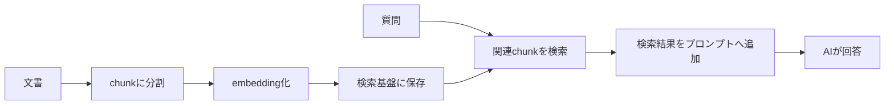

## 結論

RAGは、ベクトルDBを入れれば完成する仕組みではありません。

重要なのは、文書をどう分けるか、どの情報を検索するか、検索結果をどう回答に渡すか、回答が正しいかをどう確認するかです。


## 対象読者

- RAGという言葉は知っているが仕組みが分からない人
- ベクトルDBを入れれば解決すると考えている人
- 社内文書検索やFAQチャットを作りたい人
- RAGで失敗しやすいポイントを先に知りたい人

## RAGの基本構造

RAGは、検索した情報をAIの回答に使う構成です。



この中で、検索結果がずれていると、AIの回答もずれます。RAGの品質は、モデル性能だけでなく検索品質に大きく左右されます。

## 用語整理

| 用語 | 意味 | 注意点 |
| --- | --- | --- |
| chunk | 文書を分割した単位 | 大きすぎても小さすぎても検索しにくい |
| embedding | 文章を数値ベクトルに変換すること | モデルや設定で検索結果が変わる |
| ベクトルDB | embeddingを保存し検索する基盤 | 入れれば解決するものではない |
| 検索結果 | 質問に近い文書断片 | 正しい情報が取れているか確認が必要 |
| 参照元 | 回答の根拠になる文書 | 表示しないと信頼性を確認しにくい |

## chunk設計の考え方

chunkはRAGの品質に直結します。

1つのchunkに複数の話題が混ざると、検索結果に不要な情報が入りやすくなります。一方で短すぎると、回答に必要な文脈が失われます。

最初は、見出し単位や意味のまとまり単位で分けると確認しやすくなります。

| 文書の種類 | chunkの切り方 |
| --- | --- |
| FAQ | 質問と回答のセット |
| 手順書 | 見出しまたは手順単位 |
| 規約 | 条項単位 |
| Markdown記事 | 見出し単位 |
| 議事録 | 議題単位 |

## RAGでよくある失敗

| 失敗 | 原因 | 対策 |
| --- | --- | --- |
| 関係ない回答をする | 検索結果がずれている | 検索結果ログを見る |
| 古い情報で回答する | 文書更新が反映されていない | 再取り込みの仕組みを作る |
| 回答が長くて曖昧 | 渡す文脈が多すぎる | 上位件数とchunkを調整する |
| 根拠が分からない | 参照元を表示していない | 文書名やURLを表示する |
| コストが高い | 検索結果を渡しすぎる | chunk数と文字量を調整する |

## 最初に作るRAGのおすすめ構成

最初から複雑なランキングや高度な検索を入れる必要はありません。

```text
文書: Markdownまたはテキスト
分割: 見出し単位
検索件数: 上位3〜5件
回答: 検索結果に基づいて回答
表示: 回答 + 参照元
評価: 固定の質問セットで確認
```

まずは、検索結果が妥当かを目で確認できる状態にすることが重要です。

## 評価用の質問セットを作る

RAGを改善するには、毎回同じ質問で確認できるようにします。

| 質問 | 期待する参照文書 | 期待する回答 |
| --- | --- | --- |
| 料金プランは？ | pricing.md | プラン一覧を説明する |
| 解約方法は？ | account.md | 解約手順を説明する |
| API制限は？ | api-limits.md | 上限と注意点を説明する |

この表があると、chunkや検索設定を変えたときに改善したか判断しやすくなります。

## チェックリスト

- [ ] 文書の更新頻度を把握している
- [ ] chunk単位を説明できる
- [ ] 検索結果をログで確認できる
- [ ] 参照元を表示できる
- [ ] 評価用の質問セットがある
- [ ] 渡す文脈の件数と文字量を調整できる

## 関連記事

- [AIプロダクト開発とは？生成AIアプリを作る前に知るべき基本](/articles/what-is-ai-product-development)
- [Next.jsでAIアプリを作る基本構成：画面・API・AI API・ログの役割](/articles/nextjs-ai-app-basic-architecture)
- [AI APIの料金を見積もる方法：トークン・実行回数・月間コストの考え方](/articles/ai-api-cost-estimation-guide)

## まとめ

RAGは、ベクトルDBを導入するだけでは完成しません。

文書設計、chunk設計、検索品質、参照元表示、評価質問をセットで考えることで、実用に近いRAGアプリになります。
