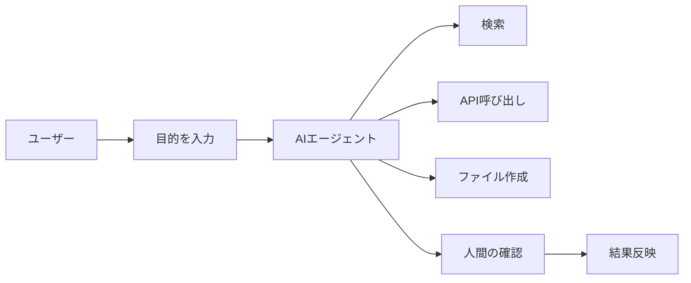

## 結論

AIエージェント競争は、AIアプリ開発を「チャット画面を作る」段階から、「AIにどこまで作業を任せるかを設計する」段階へ進めています。

開発者が見るべきポイントは、モデル性能の比較だけではありません。実務では、ツール実行、権限管理、ログ、コスト、人間の承認フローが重要になります。

| 変化 | 開発者への影響 |
| --- | --- |
| ツール実行が増える | API、DB、ファイル操作などの安全設計が必要になる |
| 長い作業を任せやすくなる | 途中経過、停止条件、再開方法を設計する必要がある |
| 外部サービス連携が増える | 認証、権限、監査ログの重要度が上がる |
| 自動化範囲が広がる | 人間が確認するポイントを明確にする必要がある |
| 失敗時の影響が大きくなる | ロールバックや手動介入の設計が必要になる |

## 対象読者

この記事は、次のような人向けです。

- AIエージェント関連ニュースを実装目線で読みたい開発者
- AIアプリにツール実行や自動処理を入れたい人
- OpenAI、Anthropic、Google、Microsoftなどの動きをどう評価すべきか整理したい人
- 個人開発や小規模チームでAIエージェント機能を扱う前提を知りたい人

## ニュースとして見るべきこと

AIエージェント関連の発表では、モデル名やデモだけが注目されがちです。

ただし、アプリ開発者が見るべきなのは、次のような実装上の変化です。

| 観点 | 確認すること |
| --- | --- |
| ツール実行 | 外部API、検索、ファイル操作、DB操作をどう呼べるか |
| 状態管理 | 長い作業の途中経過や再開をどう扱うか |
| 権限管理 | 読み取り、作成、更新、削除を分けられるか |
| ログ | 何を実行したか後から追跡できるか |
| 承認フロー | 危険な操作の前に人間が確認できるか |
| コスト | 長時間実行や複数回のAPI呼び出しで費用が増えないか |

この視点で見ると、AIエージェント競争は「賢いモデルの競争」だけでなく、「安全に作業させる基盤の競争」でもあります。

## AIアプリの設計はどう変わるか

従来のAIアプリは、ユーザーが入力し、AIが1回回答する形が中心でした。

AIエージェント型になると、AIが複数の手順を組み合わせて作業します。

この構成では、単にAIの回答を表示するだけでは不十分です。

どのツールを使ったか、何回実行したか、どこで止めるか、誰が承認するかを設計する必要があります。

## 個人開発で特に注意すること

個人開発や小規模チームでは、AIエージェント機能を入れる前に、範囲をかなり絞るべきです。

最初からファイル削除、DB更新、外部送信まで自動実行させると、失敗時の影響が大きくなります。

おすすめは、次の順番です。

| 段階 | 任せる作業 | 承認の必要性 |
| --- | --- | --- |
| 1 | 情報収集、要約、候補作成 | 低い |
| 2 | draft作成、Issue作成、チェックリスト作成 | 中程度 |
| 3 | ファイル編集、PR作成 | 高い |
| 4 | 本番反映、削除、外部送信 | 必ず人間が承認 |

このプロジェクトで採用している「GitHub Issue作成、Codexの計画提示、承認後に作業、PRやVPS反映」という流れは、この考え方に近い運用です。

## エージェント機能を見るときのチェックリスト

AIエージェント関連ニュースを読むときは、次を確認します。

- [ ] どのツール実行が可能になったのか
- [ ] 読み取り専用と書き込み操作を分けられるか
- [ ] 実行ログを残せるか
- [ ] 人間の承認を挟めるか
- [ ] 失敗時に停止できるか
- [ ] APIコストや実行時間が増えすぎないか
- [ ] 既存アプリに入れる場合、最初にどの範囲へ限定するか

## 関連記事

- [AIエージェント開発で暴走・無限ループを防ぐ設計](/articles/app-agent-loop-prevention)
- [Next.jsでAIアプリを作る基本構成：画面・API・AI API・ログの役割](/articles/nextjs-ai-app-basic-architecture)
- [AI APIの料金を見積もる方法：トークン・実行回数・月間コストの考え方](/articles/ai-api-cost-estimation-guide)

## まとめ

AIエージェント競争は、AIアプリの作り方を変えています。

ただし、重要なのは「どの企業のモデルが強いか」だけではありません。開発者は、ツール実行、権限、ログ、承認、コストを含めて設計する必要があります。

小規模なAIアプリでは、最初から全自動化を狙うより、情報収集、候補作成、下書き作成のような低リスク領域から導入するのが現実的です。
